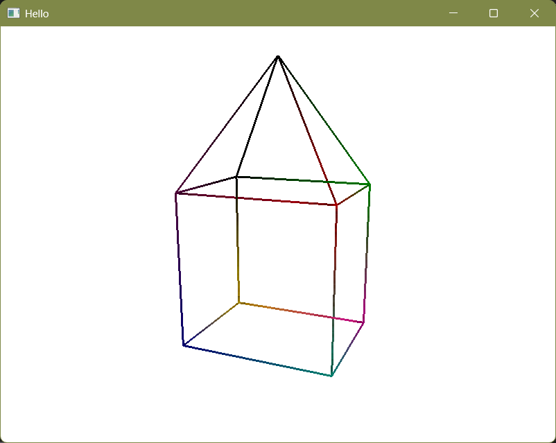

# First try on OpenGL

This is my first project connected to OpenGL. I will gladly listen to criticism and advice on this matter. At the
current stage all up to date code can be found in
this branch. I'm trying to implement basic OpenGL staff in OOP style there.

## UPDATE

I moved further through tutorial and created my first 3d figure, also I learned about textures, shaders and
transformations.
Steel need to dive deeper into transformations and cameras.

# Functionality

Now program can display 3D images that consist's of lines. Example below.



# Instalation

To try existing code you need to clone this branch, install GLFW.
Instalation guidlines can be found [here](https://learnopengl.com/Getting-started/Creating-a-window)
Prefered lib file structure

```
lirary:
| .lib file
| include:
| | GLFW:
| | | ...
```

After instalation change locations in CMakeList.txt file to locations, where you stored GLFW.

```
...
set_target_properties(GLFW PROPERTIES
        IMPORTED_LOCATION "YOUR_PATH_TO_LIB_FILE"
        INTERFACE_INCLUDE_DIRECTORIES "YOUR_PATH_TO_GLFW_FOLDER"
)
...
target_include_directories(TestingOpenGL PRIVATE "YOUR_PATH_TO_INCLUDE_FOLDER")
```

---
